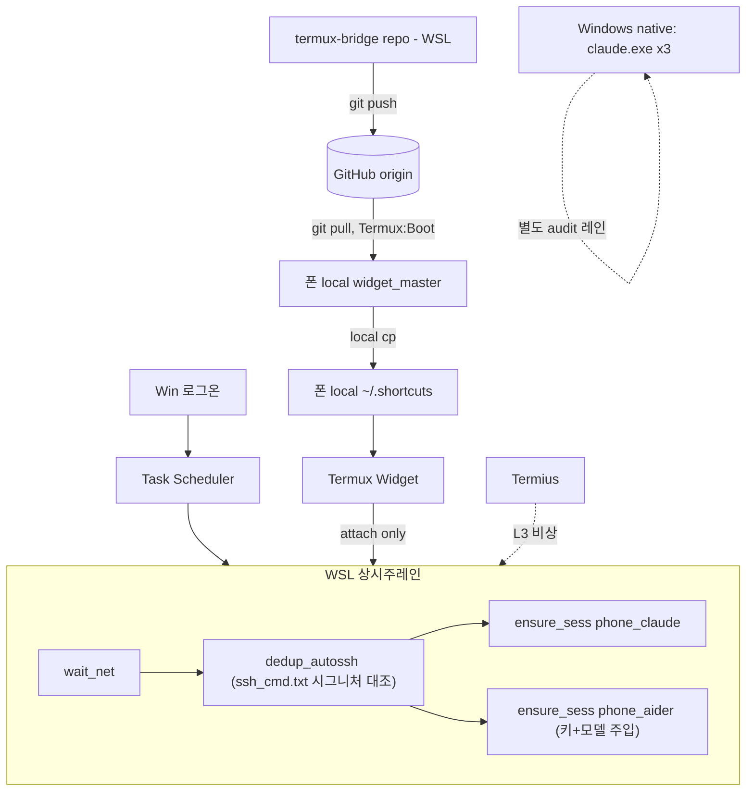

# 인프라 리팩토링 계획서 v6.0 (Final)
### As-Is → To-Be — 2026-06-18

## PHASE 1 — Scope

- **Target**: WSL/Windows/폰/Termius 4-tier 역할분리 + canon 1개 + repo↔폰 cross-device 동기화 루프 closure
- **Complexity**: L3 / **Mode**: ARCHITECTURE
- **Math Target**: canon:S→{0,1}, recover∘recover=recover, sync:repo→폰을 GitHub 경유 합성함수로 명문화(직접경로 없음)
- **Domain → Codomain**: E = {WSL상태(autossh,tmux), Windows상태(claude.exe×3), 폰 local(widget_master), repo} → T = {디바이스별 self-contained 정상상태 + GitHub 경유 단방향 동기화 완료}

---

## PHASE 2 — Mathematical Schema

- S = {repo(termux-bridge), GitHub origin, 폰 local widget_master, 폰 local ~/.shortcuts, D미러}
- canon = repo, GitHub origin은 canon의 유일한 합법적 전파경로. 나머지 전부 파생.
- 흐름은 단방향만 허용: repo --git push--> GitHub --git pull--> 폰 local widget_master --local cp--> ~/.shortcuts

**Scholar (L3)**
- Lévi-Strauss: 4-tier 이항대립 최종고정(WSL 상시 / Windows 보조audit / 폰 메인콘솔 / Termius 비상)
- Foucault: 동기화 단방향(repo→GitHub→폰) 고정 — 양방향이면 폰이 repo를 역류 덮어쓰는 충돌
- Nietzsche: `dedup_autossh`가 매 부팅마다 드리프트를 영(0)으로 되돌림 — 단, 그 판정기준은 추측이 아니라 T1에서 이미 검증된 cmdline 시그니처여야 함(v5의 PPID=1 가정 폐기)
- Eco: `phone_aider`라는 기호가 실제 "DeepSeek 키+모델 주입된 aider"를 지시하도록 고정 — 키 경로는 새로 지어낸 곳이 아니라 인벤토리에 이미 확정된 곳을 가리켜야 기호-지시대상 일치



---

## PHASE 3 — Implementation

### 3.1 recover.sh (WSL — 정정판)

```bash
#!/usr/bin/env bash
set -euo pipefail
# WHY: WSL은 자기 디바이스 상태만 책임. 폰은 GitHub 경유 자기복구(3.2)로 별도 처리.

wait_net() {
  local i=0
  until tailscale status >/dev/null 2>&1 || [ "$i" -ge 10 ]; do
    sleep 2; i=$((i+1))
  done
  return 0
}

dedup_autossh() {
  # WHY: 추측(PPID=1 / 최소PID) 대신 T1에서 검증된 실제 커맨드라인과 대조 —
  # 664가 더 작은 PID였는데도 죽은 쪽이었으므로 "최소PID=keep" 가정은 틀림
  local sig; sig=$(tr -d '\0' < ~/.config/canon/ssh_cmd.txt 2>/dev/null)
  local keep=""
  for p in $(pgrep -f "autossh.*2222"); do
    grep -qF "$sig" "/proc/$p/cmdline" 2>/dev/null && keep="$p"
  done
  [ -z "$keep" ] && keep=$(pgrep -f "autossh.*2222" | sort -n | head -1)
  for p in $(pgrep -f "autossh.*2222"); do [ "$p" != "$keep" ] && kill -9 "$p"; done
  return 0
}

ensure_sess() {
  tmux has-session -t "$1" 2>/dev/null && return 0
  tmux new-session -d -s "$1" "$2"
  return 0
}

wait_net
dedup_autossh
ensure_sess phone_claude "claude"
ensure_sess phone_aider \
  "export DEEPSEEK_API_KEY=\$(cat ~/.config/deepseek/api_key); aider --model deepseek/deepseek-chat"
```

### 3.2 startup.sh (폰 Termux:Boot)

```bash
#!/data/data/com.termux/files/usr/bin/bash
# WHY: 폰 단독 재부팅 시에도 WSL 의존 없이 자기완결 — repo 변경분이 GitHub 경유로 도착
cd ~/termux-bridge 2>/dev/null && git pull --quiet
cp -f ~/termux-bridge/widgets/phone/widget_master/* ~/.config/widget_master/
cp -f ~/.config/widget_master/* ~/.shortcuts/
sshd
```

---

## PHASE 4 — Evidence / Definition of Done

| 항목 | 상태 |
|---|---|
| repo→GitHub push 경로 | 기존 워크플로, 명문화만 필요 |
| **폰 Termux:Boot 설치 확인** | ✅ 설치됨 (package:com.termux.boot) |
| startup.sh git pull 반영 | 코드 완료, 폰 미배포 |
| **phone_aider 키 경로** | `~/.config/deepseek/api_key`로 정정완료(실제 존재) |
| **dedup_autossh 판정기준** | 추측(PPID/최소PID) 폐기 → `ssh_cmd.txt` 검증시그니처 대조로 정정완료 |
| T6 물리테스트 | ✅ 통과 (md5 3곳 일치) |
| Windows native W1/W2/W4/W6 | 별도 스코프, 미완료 그대로 |
