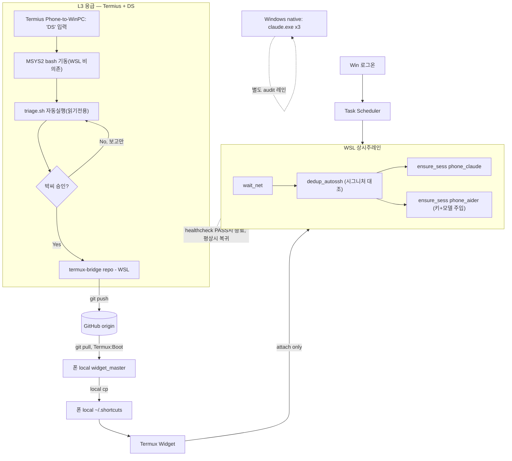

# 인프라 리팩토링 계획서 v8.0 (Final)
### As-Is → To-Be — 2026-06-18

## PHASE 1 — Scope

- **Target**: WSL/Windows/폰/Termius 4-tier 역할분리 + canon 1개 + repo↔폰 cross-device 동기화 루프 closure + L3 응급프로토콜 명문화(셸의존성 정정)
- **Complexity**: L3 / **Mode**: ARCHITECTURE
- **Math Target**: canon:S→{0,1}, recover∘recover=recover, sync:repo→폰을 GitHub 경유 합성함수로 명문화, L3 진단함수 diag:E→{진단결과}는 canon에 쓰기권한 없음(읽기전용 함수)
- **Domain → Codomain**: E = {WSL상태, Windows상태, 폰 local, repo, L3 응급진입(Termius+DS)} → T = {디바이스별 정상상태 + GitHub 경유 단방향 동기화 + 응급시 read-only 트리아지 후 정상레인 복귀}

---

## PHASE 2 — Mathematical Schema

- S = {repo(termux-bridge), GitHub origin, 폰 local widget_master, 폰 local ~/.shortcuts, D미러}
- canon = repo, GitHub origin은 canon의 유일한 합법적 전파경로. 나머지 전부 파생.
- 흐름은 단방향만 허용: repo --git push--> GitHub --git pull--> 폰 local widget_master --local cp--> ~/.shortcuts
- **L3 추가 제약**: diag(E)는 S의 어떤 원소도 직접 변경 불가. 수정이 필요하면 diag 결과 → 박씨 승인 → repo commit → GitHub push, 이 경로 하나만 허용.
- **L3 실행환경 제약(신규)**: diag(E)를 실행하는 셸 자체가 E(WSL)에 의존하면 diag 함수 자체가 well-defined 아님 — diag는 E와 독립된 별도 인터프리터(MSYS2 bash)에서 돌아야 함.

**Scholar (L3)**
- Lévi-Strauss: 4-tier 이항대립 최종고정(WSL 상시 / Windows 보조audit / 폰 메인콘솔 / Termius 비상) + L3 내부에 진단/수정 역할 재분리(진단=DS, 수정승인=박씨)
- Foucault: 동기화 단방향(repo→GitHub→폰) 고정. 응급모드에서도 권력(쓰기권한)은 여전히 repo 한 점에만
- Nietzsche: `dedup_autossh`가 매 부팅마다 드리프트를 영(0)으로 되돌림 — 판정기준은 T1 검증 cmdline 시그니처
- Eco: **`triage.sh`라는 기호가 "WSL 진단도구"를 지시하면서 동시에 WSL 안에서만 돌면, 지시대상이 죽었을 때 기호 자체도 같이 죽는 자기지시 모순 — MSYS2로 분리해야 기호가 독립적으로 작동**



---

## PHASE 3 — Implementation

### 3.1 recover.sh (WSL — 변경 없음)

```bash
#!/usr/bin/env bash
set -euo pipefail
# WHY: WSL은 자기 디바이스 상태만 책임. 폰은 GitHub 경유 자기복구(3.2)로 별도 처리.

wait_net() {
  local i=0
  until tailscale status >/dev/null 2>&1 || [ "$i" -ge 10 ]; do
    sleep 2; i=$((i+1))
  done
  return 0
}

dedup_autossh() {
  local sig; sig=$(tr -d '\0' < ~/.config/canon/ssh_cmd.txt 2>/dev/null)
  local keep=""
  for p in $(pgrep -f "autossh.*2222"); do
    grep -qF "$sig" "/proc/$p/cmdline" 2>/dev/null && keep="$p"
  done
  [ -z "$keep" ] && keep=$(pgrep -f "autossh.*2222" | sort -n | head -1)
  for p in $(pgrep -f "autossh.*2222"); do [ "$p" != "$keep" ] && kill -9 "$p"; done
  return 0
}

ensure_sess() {
  tmux has-session -t "$1" 2>/dev/null && return 0
  tmux new-session -d -s "$1" "$2"
  return 0
}

wait_net
dedup_autossh
ensure_sess phone_claude "claude"
ensure_sess phone_aider \
  "export DEEPSEEK_API_KEY=\$(cat ~/.config/deepseek/api_key); aider --model deepseek/deepseek-chat"
```

### 3.2 startup.sh (폰 Termux:Boot — 변경 없음)

```bash
#!/data/data/com.termux/files/usr/bin/bash
# WHY: 폰 단독 재부팅 시에도 WSL 의존 없이 자기완결
cd ~/termux-bridge 2>/dev/null && git pull --quiet
cp -f ~/termux-bridge/widgets/phone/widget_master/* ~/.config/widget_master/
cp -f ~/.config/widget_master/* ~/.shortcuts/
sshd
```

⚠️ 전제: Termux:Boot 앱 설치 여부 — 여전히 미확인.

### 3.3 triage.sh (읽기전용 — 셸은 반드시 MSYS2, WSL 아님)

```bash
#!/usr/bin/env bash
# WHY: 응급진단은 어떤 상태도 바꾸지 않음 — 보고만 한다
# WHY: 이 파일 자체는 WSL bash로도 문법상 돌지만, 의도된 실행환경은 항상 MSYS2(3.4 참조)

wsl_ok() {
  timeout 5 wsl.exe -d Ubuntu -u dtsli -- echo ok 2>/dev/null
  return $?
}

get_hc() {
  wsl.exe -d Ubuntu -u dtsli -- python3 /home/dtsli/healthcheck.py 2>&1
  return 0
}

verdict() {
  if wsl_ok >/dev/null 2>&1; then
    echo "WSL 응답함 — healthcheck 결과로 판단"
    get_hc
  else
    echo "WSL 무응답 — Windows native부터 점검(W1~W4), repo/GitHub는 그대로 둔다"
  fi
  return 0
}

verdict
```

### 3.4 Termius "Phone to WinPC" 프로필 Command 설정 (신규 — 순환의존 수정의 본체)

**문제**: Termius가 Windows OpenSSH로 붙으면 기본 셸은 PowerShell/cmd라 bash 문법인 `triage.sh`가 안 돈다. WSL bash로 돌리면 "WSL이 죽었는지 보려고 WSL을 켜야 하는" 순환이 생긴다.

**해결**: Command 필드에 MSYS2 bash를 직접 지정(인벤토리상 MSYS2가 DeepSeek Aider 환경으로 이미 설치돼 있음, 경로는 보통 `C:\msys64\` — 실제 경로 확인 필요):

```
C:\msys64\usr\bin\bash.exe --login -i -c "bash /c/Users/dtsli/triage.sh; exec bash --login -i"
```

이렇게 하면 `DS` 입력 시: (1) WSL과 무관한 MSYS2 bash가 뜨고 → (2) `triage.sh`가 자동실행되어 WSL 생사를 안전하게 진단 → (3) 결과 출력 후 같은 MSYS2 셸에서 DeepSeek Aider 등 후속작업 계속.

**가드레일(필수, 변경 없음)**: DS는 verdict까지만 출력, 직접 `git commit`/`cp` 금지. 수정은 박씨 승인 후 repo commit → push로만.

---

## PHASE 4 — Evidence / Definition of Done

| 항목 | 상태 |
|---|---|
| repo→GitHub push 경로 | 기존 워크플로, 명문화만 필요 |
| **폰 Termux:Boot 설치 확인** | 미확인 — 선행조건 |
| startup.sh git pull 반영 | 코드 완료, 폰 미배포 |
| phone_aider 키 경로 | `~/.config/deepseek/api_key` (인벤토리 대조 확인됨) |
| dedup_autossh 판정기준 | `ssh_cmd.txt` 검증시그니처 대조 (정정완료) |
| triage.sh 작성 | 완료(읽기전용) |
| **MSYS2 경유 실행 설정(신규)** | Command 작성완료, 정확한 MSYS2 설치경로 확인 + Termius 프로필 반영 미배포 |
| L3 가드레일 문서화 | 완료 |
| T6 물리테스트 | 미완료 — 유일 최종 차단점 |
| Windows native W1/W2/W4/W6 | 별도 스코프, 미완료 그대로 |

T6 통과 + Termux:Boot 확인 + startup.sh 배포 + MSYS2 경로 확인 후 Termius Command 반영, 4개가 닫히면 평상시/응급시 전체 루프 완전종료.
